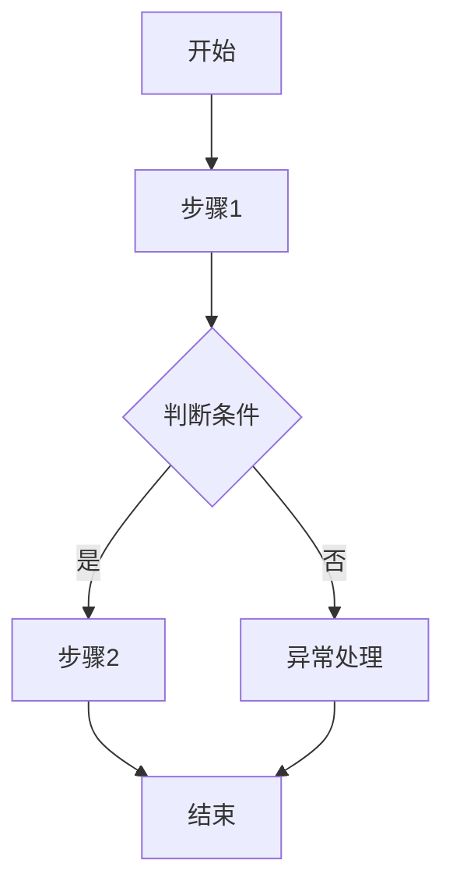
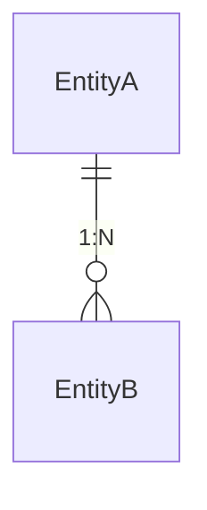

# [功能名称] 开发设计文档（标准版）

**创建者**: [作者]
**创建时间**: [日期]
**最后修改**: [日期]
**版本**: v1.0
**状态**: 草稿

> **适用场景**: 常规功能开发、模块新增、接口开发

---

<!-- LLM指导: 标准级模板适用于常规功能开发，必须包含：
     - 总体设计: 功能概述、系统边界、技术选型
     - 功能设计: 流程图、业务规则、异常处理
     - 数据/接口设计: 表结构、API定义
     - 安全/测试/风险: 不可省略 -->
## 一、总体设计

### 1.1 功能概述

<!-- LLM指导: 关联到 spec.md 中的用户故事，说明“做什么”和“为什么做” -->
简要描述功能目的、范围和预期效果。

### 1.2 系统边界

<!-- LLM指导: 明确“什么在系统内”和“什么在系统外” -->
明确系统边界和外部依赖：
- 输入/输出边界
- 与其他系统的集成点

### 1.3 技术选型

<!-- LLM指导: 技术选型必须说明“为什么选这个”，不要只写“选了什么” -->
| 技术项 | 选型 | 理由 |
|--------|------|------|
| [技术项] | [选型] | [理由] |

---

<!-- LLM指导: 功能设计是核心章节，每个用户故事都应有对应的功能模块 -->
## 二、功能设计

### 2.1 [功能模块1]

#### 功能描述

<!-- LLM指导: 关联到 spec.md 中的用户故事编号 -->
简要描述功能目的和范围。

#### 流程设计

<!-- LLM指导: 使用 Mermaid 流程图，必须包含异常分支 -->

#### 业务规则

<!-- LLM指导: 业务规则必须可测试，格式为“当 X 时，应该 Y” -->
列出该功能的业务规则和约束。

#### 异常处理

<!-- LLM指导: 列出所有可能的异常场景及错误码 -->

| 异常场景 | 处理方式 | 错误码 |
|----------|----------|--------|
| [场景] | [处理] | [错误码] |

### 2.2 [功能模块2]

（按相同结构描述其他功能模块）

---

<!-- LLM指导: 数据设计必须与功能设计中的数据需求对应 -->
## 三、数据设计

### 3.1 数据模型

<!-- LLM指导: 使用 Mermaid 实体关系图展示数据模型 -->

描述主要实体及其关系：

### 3.2 表结构设计

<!-- LLM指导: 表结构必须包含字段类型、索引、约束 -->
#### [表名]

| 字段名 | 类型 | 是否必填 | 说明 |
|--------|------|----------|------|
| id | varchar(36) | 是 | UUID主键 |
| name | varchar(255) | 是 | 名称 |

---

<!-- LLM指导: 接口设计必须完整，包含请求/响应示例和错误码 -->
## 四、接口设计

### 4.1 [接口名称]

<!-- LLM指导: 请求/响应示例使用真实数据，不要用 xxx -->

| 属性 | 值 |
|------|-----|
| URL | /api/v1/xxx |
| 请求方式 | GET/POST/PUT/DELETE |

**请求参数**:

| 参数名 | 类型 | 是否必填 | 说明 |
|--------|------|----------|------|
| id | string | Y | 描述 |

**返回参数**:

| 属性名 | 类型 | 说明 |
|--------|------|------|
| status | string | success/failure |
| data | object | 响应数据 |

**错误码**:

| 错误码 | 说明 |
|--------|------|
| [错误码] | [说明] |

---

<!-- LLM指导: 安全设计不可省略，即使是内部系统也必须考虑 -->
## 五、安全设计

### 5.1 权限控制

<!-- LLM指导: 明确说明谁可以访问、访问什么资源 -->
描述接口的权限要求。

### 5.2 数据安全

<!-- LLM指导: 列出敏感数据字段及其保护措施 -->
描述敏感数据的保护措施。

---

<!-- LLM指导: 测试要点必须与功能设计中的业务规则对应 -->
## 六、测试要点

### 6.1 测试用例

<!-- LLM指导: 包含正常/边界/异常场景，输入/输出必须具体 -->

| 场景 | 输入 | 预期输出 | 优先级 |
|------|------|----------|--------|
| 正常场景 | [输入] | [输出] | P1 |
| 边界场景 | [输入] | [输出] | P2 |
| 异常场景 | [输入] | [输出] | P2 |

---

<!-- LLM指导: 风险与待定项必须认真填写，不要留空 -->
## 七、风险与待定项

### 7.1 已知风险

<!-- LLM指导: 每个风险必须有缓解措施 -->
| 风险 | 影响 | 缓解措施 |
|------|------|----------|
| [风险描述] | 高/中/低 | [缓解方案] |

### 7.2 待定项

<!-- LLM指导: 待定项必须有明确的跟进计划 -->
- [ ] [待定项1]
- [ ] [待定项2]

---

## 修订历史

| 版本 | 日期 | 作者 | 修改内容 |
|------|------|------|----------|
| v1.0 | [日期] | [作者] | 初始版本 |
