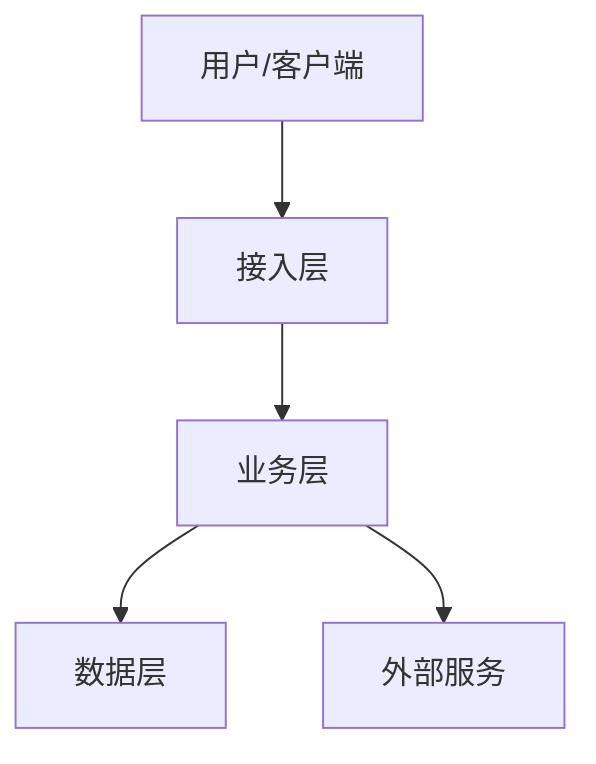
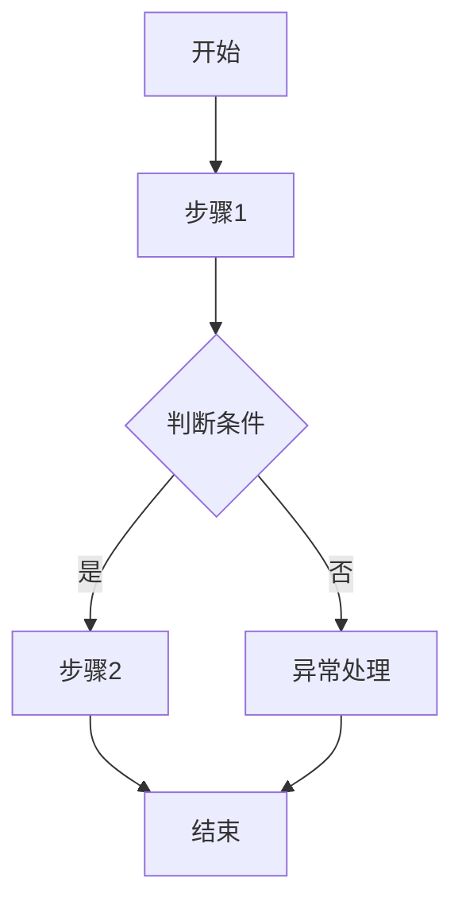
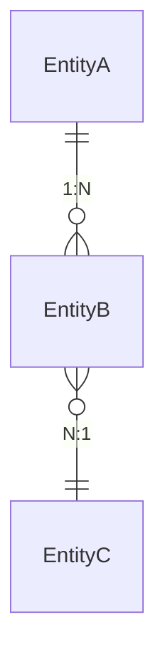

# [功能名称] 开发设计文档

**创建者**: [作者]
**创建时间**: [日期]
**最后修改**: [日期]
**版本**: v1.0
**状态**: 草稿

---

> **提示**: 标记为【可选】的章节如不适用，可直接删除该章节。

---

## 术语定义表 【必选】

<!-- LLM指导: 术语定义表是防止歧义的关键。必须明确区分：
     - "目标系统"（被操作的对象）vs "工具本身"（执行操作的程序）
     - 变量的物理含义（实际指向什么路径/资源）
     - 同一术语在不同上下文的含义是否一致 -->

| 术语/变量 | 定义 | 示例值 | 备注 |
|-----------|------|--------|------|
| [变量名] | [明确定义，区分"目标"vs"工具"] | [具体示例] | [使用场景] |

---

<!-- LLM指导: 总体设计是整个文档的纲领，必须清晰回答“做什么”和“怎么做”。
     - 架构图使用 ASCII 或 Mermaid 格式
     - 技术选型必须说明“为什么选这个”，而不只是“选了什么”
     - 设计原则必须与需求文档中的约束对应 -->
## 一、总体设计 【必选】

### 1.1 系统架构

<!-- LLM指导: 使用 Mermaid 图表展示架构，每个组件必须有明确职责 -->



描述整体架构设计，包括：
- 系统组件及其职责
- 组件间的交互关系
- 技术选型说明

### 1.2 设计原则

<!-- LLM指导: 不要简单罗列原则，要说明“如何体现”。例如：“可扩展性: 通过插件机制支持新补丁类型” -->
列出本设计遵循的核心原则：
- 可扩展性
- 可维护性
- 安全性
- 性能

### 1.3 系统边界

<!-- LLM指导: 明确“什么在系统内”和“什么在系统外”，这对后续接口设计至关重要 -->
明确系统边界和外部依赖：
- 输入/输出边界
- 与其他系统的集成点
- 第三方服务依赖

### 1.4 假设与前提 【必选】

<!-- LLM指导: 明确技术方案成立的前提条件，任一失效需重新评估设计
     - 从 spec.md 的假设与约束章节继承
     - 补充技术层面的假设（环境、依赖、兼容性等）
     - 每个假设标记验证状态 -->

| 假设 | 验证状态 | 失效影响 |
|------|----------|----------|
| [例如: 目标系统已安装 Python 3.8+] | ✅ 已验证 / ⚠️ 待验证 | [例如: 需增加兼容层] |
| [例如: 网络环境可访问内部仓库] | ✅ 已验证 / ⚠️ 待验证 | [例如: 需离线安装方案] |

---

## 二、部署设计 【可选】

### 2.1 服务信息

| 服务名称 | 部署节点 | 语言/框架 | 端口 | 说明 |
|---------|---------|----------|------|------|
| [服务名] | [节点类型] | [技术栈] | [端口] | [描述] |

### 2.2 部署流程

描述服务的部署步骤（环境准备 → 配置设置 → 服务安装 → 启动验证）。

---

<!-- LLM指导: 功能设计是核心章节，每个用户故事都应有对应的功能模块。
     - 流程图必须包含异常分支
     - 业务规则必须可测试（有明确的输入/输出）
     - 异常处理必须覆盖所有边界条件 -->
## 三、功能设计 【必选】

### 3.1 [功能模块1]

#### 3.1.1 功能描述

<!-- LLM指导: 关联到 spec.md 中的用户故事编号 -->
简要描述功能目的和范围。

#### 3.1.2 流程设计

<!-- LLM指导: 使用 Mermaid 流程图，必须包含异常分支 -->
使用流程图描述功能流程：



#### 3.1.3 业务规则

<!-- LLM指导: 业务规则必须可测试，格式为“当 X 时，应该 Y” -->
列出该功能的业务规则和约束。

#### 3.1.4 异常处理

<!-- LLM指导: 列出所有可能的异常场景及处理方式，包括错误码 -->
描述异常场景及处理方式。

#### 3.1.5 代码脚手架 【必选】

<!-- LLM指导: 代码脚手架是指导 LLM 生成代码的关键！必须包含：
     - 类/函数的完整签名（参数类型、返回类型）
     - 核心方法的职责说明
     - 依赖注入方式
     - 错误处理模式

     根据项目类型选择对应格式：
     - Python: class + type hints + docstring
     - Shell: function + 参数说明 + 返回值
     - Go: struct + interface + error handling
     - JavaScript/TypeScript: class/function + JSDoc/types -->

**Python 示例**:
```python
class [ModuleName]Service:
    """
    [模块功能描述]

    职责: [单一职责描述]
    依赖: [依赖的服务/组件]
    """

    def __init__(self, config: [ConfigType], logger: Logger):
        """初始化服务"""
        self.config = config
        self.logger = logger

    def [method_name](self, param1: Type1, param2: Type2) -> Result[ReturnType, ErrorType]:
        """
        [方法功能描述]

        Args:
            param1: [参数1说明]
            param2: [参数2说明]

        Returns:
            Result[ReturnType, ErrorType]: [返回值说明]

        Raises:
            [ExceptionType]: [异常条件]

        设计追溯: FR-xxx
        """
        pass
```

**Shell 脚本示例**:
```bash
#!/bin/bash
# [模块功能描述]
#
# 职责: [单一职责描述]
# 依赖: [依赖的脚本/命令]
#
# 设计追溯: FR-xxx

# 函数: [FunctionName]
# 参数:
#   $1 - [参数1说明]
#   $2 - [参数2说明]
# 返回:
#   0 - 成功
#   1 - [错误场景1]
#   2 - [错误场景2]
# 副作用:
#   - [文件操作/状态变更]
[FunctionName]() {
    local param1="$1"
    local param2="$2"

    # TODO: 实现逻辑
}
```

### 3.2 [功能模块2]

（按相同结构描述其他功能模块，每个模块必须包含代码脚手架）

---

<!-- LLM指导: 数据库设计必须与功能设计中的数据需求对应。
     - 表结构必须包含字段类型、索引、约束
     - 必须考虑数据迁移方案（如适用） -->
## 四、数据库设计 【可选】

### 4.1 实体关系图

描述主要实体及其关系：



### 4.2 表结构设计

#### 4.2.1 [表名]

| 字段名 | 类型 | 主键 | 索引 | 必填 | 说明 |
|-------|------|-----|-----|-----|------|
| id | varchar(36) | 是 | 是 | 是 | UUID主键 |
| ... | ... | ... | ... | ... | ... |

### 4.3 索引设计

列出关键索引及其用途。

### 4.4 数据迁移

描述数据迁移方案（如适用）。

---

<!-- LLM指导: 接口设计必须完整，包含：
     - 请求/响应示例（使用真实数据，不要用 xxx）
     - 所有可能的错误码和错误消息
     - 权限要求 -->
## 五、接口设计 【可选】

### 5.1 [服务名]-Web接口

#### 5.1.1 [接口名称]

**接口描述**: [描述]

| 属性 | 值 |
|-----|-----|
| URL | /api/v1/xxx |
| 请求方式 | GET/POST/PUT/DELETE |
| 请求类型 | application/json |
| 返回类型 | application/json |

**请求参数**:

| 参数名 | 数据类型 | 参数类型 | 是否必填 | 说明 |
|-------|---------|---------|---------|------|
| id | string | path/query/body | Y/N | 描述 |

**返回参数**:

| 属性名 | 类型 | 说明 |
|-------|------|------|
| status | string | 请求结果: success/failure |
| responseData | object | 响应数据 |
| error | object | 错误信息 |

**示例**: `POST /api/v1/xxx {"id": "123"}` → `{"status": "success", "data": {...}}`

---

## 六、配置文件 【可选】

| 配置文件 | 路径 | 关键配置项 |
|----------|------|------------|
| [配置名] | `etc/xxx/config.ini` | [配置项说明] |

---

## 七、依赖服务 【可选】

### 7.1 [依赖服务1]

#### 7.1.1 [接口名称]

描述依赖的外部服务接口及其用途。

---

<!-- LLM指导: 安全设计是必选章节，即使是内部系统也必须考虑。
     - 认证: 谁可以访问？
     - 授权: 访问什么资源？
     - 数据安全: 敏感数据如何加密存储和传输？ -->
## 八、安全设计 【必选】

### 8.1 认证授权

<!-- LLM指导: 明确说明认证方式和权限控制策略 -->
描述认证和授权机制。

### 8.2 数据安全

<!-- LLM指导: 列出敏感数据字段及其保护措施（加密、脱敏等） -->
描述敏感数据的保护措施。

### 8.3 审计日志

<!-- LLM指导: 说明哪些操作需要记录审计日志 -->
描述审计日志的记录策略。

---

<!-- LLM指导: 测试要点必须与功能设计中的业务规则对应。
     - 每个业务规则至少有一个测试用例
     - 包含正常场景、边界场景、异常场景 -->
## 九、测试要点 【必选】

### 9.1 单元测试

<!-- LLM指导: 列出需要单元测试的函数/方法，不要只写“关键模块” -->
列出需要单元测试的关键模块。

### 9.2 集成测试

<!-- LLM指导: 列出需要集成测试的场景，包含输入/输出/预期结果 -->
列出需要集成测试的场景。

### 9.3 性能测试

<!-- LLM指导: 明确性能指标（QPS、响应时间、并发数等） -->
列出性能测试的关键指标。

---

<!-- LLM指导: 风险与待定项必须认真填写，不要留空。
     - 风险: 包括技术风险、依赖风险、时间风险
     - 待定项: 需要进一步澄清的问题 -->
## 十、风险与待定项 【必选】

### 10.1 已知风险

<!-- LLM指导: 每个风险必须有缓解措施，不要只列风险不给方案 -->
| 风险 | 影响 | 缓解措施 |
|-----|------|---------|
| [风险描述] | [影响程度] | [缓解方案] |

### 10.2 待定项

<!-- LLM指导: 待定项必须有明确的跟进计划 -->
- [ ] [待定项1]
- [ ] [待定项2]

---

## 修订历史

| 版本 | 日期 | 作者 | 修改内容 |
|-----|------|-----|---------|
| v1.0 | [日期] | [作者] | 初始版本 |
