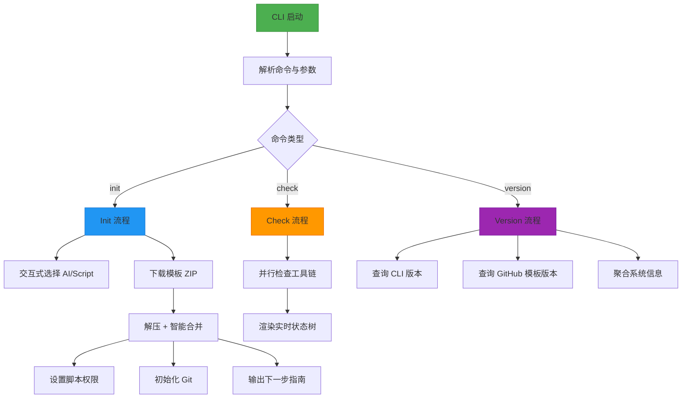
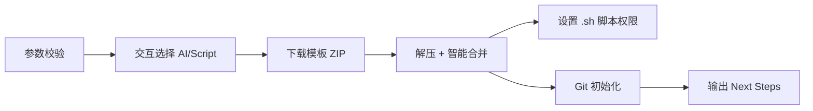

# CLI-Core

# CLI-Core 模块文档（`specify_cli`）

> **模块路径**：`src/specify_cli/__init__.py`  
> **核心定位**：Specify CN CLI 的命令行接口核心，提供项目初始化、工具检查、版本管理等基础能力，是用户与 Spec Kit CN 规范驱动开发工作流的**第一入口**和**交互中枢**。

---

## 一、设计目标与核心职责

CLI-Core 并非通用脚手架，而是专为 **“规范驱动开发”（Specification-Driven Development, SDD）** 场景深度定制的 CLI 引擎。其核心目标包括：

| 目标 | 说明 |
|------|------|
| ✅ **AI 助手原生集成** | 将 Claude、Gemini、Copilot 等 17+ AI 编程助手作为**一等公民**建模（见 `AGENT_CONFIG`），自动检测、校验、提示安装，并在模板中注入对应能力支持。 |
| ✅ **跨平台无缝体验** | 支持 Windows（PowerShell）、macOS/Linux（POSIX Shell）双脚本生态；自动适配终端输入（`readchar`）、文件权限（`chmod`）、路径处理（`pathlib`）。 |
| ✅ **健壮的 GitHub 分发机制** | 通过 GitHub Releases API 下载预构建模板 ZIP 包，内置**速率限制友好型错误处理**（含重试建议、认证引导、本地时间转换），避免因未授权请求导致的静默失败。 |
| ✅ **渐进式交互式引导** | 提供基于 `rich.Live` + `readchar` 的箭头导航选择器（`select_with_arrows`），替代传统 `input()`，提升 CLI 可用性与专业感。 |
| ✅ **安全与可维护性优先** | 默认启用 TLS 证书验证（`truststore`）、敏感路径 `.gitignore` 提示、结构化 JSON 合并（非覆盖）、临时文件自动清理、详细 debug 输出。 |

> 💡 **关键洞察**：CLI-Core 不生成代码，而是**协调工具链、分发规范模板、建立项目上下文**——它让开发者在 30 秒内获得一个已配置好 AI 助手、Git、脚本环境、VS Code 设置的“规范就绪”项目基线。

---

## 二、整体架构与数据流

CLI-Core 采用 **Typer 驱动的命令式架构**，以 `app = typer.Typer(...)` 为根，所有功能通过子命令（`@app.command()`）暴露。其核心流程高度结构化，围绕 `StepTracker` 实现状态可视化与生命周期管理。



> 🔗 **与外部模块关系**：
> - **上游依赖**：`typer`（CLI 框架）、`rich`（富文本渲染）、`httpx`（HTTP 客户端）、`truststore`（TLS 信任库）、`readchar`（跨平台键盘输入）
> - **下游协同**：`spec-kit-cn` GitHub 仓库（模板源）、`.specify/` 目录（项目内规范元数据）、各 AI 助手 CLI（如 `claude`, `gemini`）
> - **无硬耦合**：不直接调用其他 Python 模块，所有业务逻辑内聚于本文件，便于独立发布为 `uv tool` 或 `pip install`

---

## 三、核心组件详解

### 1. `StepTracker` —— 可视化执行状态引擎

**作用**：替代传统 `print("✓ Done")`，提供**层级化、实时刷新、状态感知**的进度反馈，是 CLI 用户体验的核心载体。

**关键特性**：
- ✅ **状态语义化**：`pending` / `running` / `done` / `error` / `skipped` 五态，每种状态有专属符号与颜色（● ○ ▶）。
- ✅ **Live 自动刷新**：通过 `attach_refresh()` 绑定 `Live.update()`，任何 `start()`/`complete()` 调用均触发 UI 重绘。
- ✅ **树形结构渲染**：使用 `rich.tree.Tree` 呈现步骤层级，天然支持嵌套任务（如 `extract → zip-list → extracted-summary`）。
- ✅ **轻量无副作用**：纯数据结构，不执行任何 IO，仅负责状态存储与渲染逻辑。

**典型用法**：
```python
tracker = StepTracker("Initialize Project")
tracker.add("fetch", "Fetch release info")
tracker.start("fetch")
# ... 执行网络请求 ...
tracker.complete("fetch", "v1.2.0 (12MB)")
```

### 2. `AGENT_CONFIG` —— AI 助手元数据注册表

**作用**：声明式定义所有支持的 AI 助手及其运行时特征，是 CLI 决策逻辑的**唯一事实来源**。

**字段说明**：
| 字段 | 类型 | 说明 | 示例 |
|------|------|------|------|
| `name` | `str` | 用户可见名称 | `"Claude Code"` |
| `folder` | `str` | 项目内代理专用目录（用于 `.gitignore` 提示） | `".claude/"` |
| `install_url` | `str or None` | 安装指引链接（IDE 类为 `None`） | `"https://docs.anthropic.com/..."` |
| `requires_cli` | `bool` | 是否需 CLI 工具（影响 `check_tool()` 调用） | `True` |

> ⚠️ **重要约束**：`AGENT_CONFIG` 的键名（如 `"claude"`）必须与 CLI 工具名、模板 ZIP 文件名前缀、环境变量名严格一致，确保全链路一致性。

### 3. GitHub API 集成层 —— 健壮的远程分发

包含三个协同函数，构成完整的 GitHub Release 使用闭环：

| 函数 | 职责 | 关键能力 |
|------|------|----------|
| `_github_auth_headers()` | 生成认证头 | 优先级：CLI 参数 > `GH_TOKEN` > `GITHUB_TOKEN` > 无认证 |
| `_parse_rate_limit_headers()` | 解析限流响应头 | 提取 `X-RateLimit-*` 和 `Retry-After`，转换为本地时间 |
| `_format_rate_limit_error()` | 生成用户友好的错误消息 | 包含限流详情 + 中文故障排除指南（如“认证后限额 5000/小时”） |

**设计哲学**：将 GitHub 的底层 HTTP 复杂性封装为高阶语义，使 `download_template_from_github()` 只需关注“我要哪个模板”，无需处理 `403`、`404`、`429` 的差异化逻辑。

### 4. 智能模板解压与合并（`download_and_extract_template`）

**解决的核心问题**：GitHub Release ZIP 包常含嵌套目录（如 `spec-kit-template-claude-sh/`），直接解压会导致多一层冗余路径。

**智能行为**：
- ✅ **自动展平（Flatten）**：检测 ZIP 根目录是否为单个文件夹，若是则将其内容直接提取到目标路径。
- ✅ **增量合并（Merge）**：当 `--here` 初始化当前目录时，对同名文件**不覆盖**，而是：
  - `.vscode/settings.json` → 深度合并（`merge_json_files`，递归合并嵌套对象）
  - 其他文件 → 直接覆盖（带警告提示）
- ✅ **安全清理**：下载的 ZIP 文件在解压成功后自动删除，避免磁盘污染。

**深合并逻辑**（`merge_json_files`）：
```python
# settings.json (existing)
{ "editor.tabSize": 2, "files.exclude": { "**/node_modules": true } }

# settings.json (new, from template)
{ "editor.tabSize": 4, "emerald.theme": "dark" }

# Result → tabSize updated, files.exclude preserved, emerald.theme added
{ "editor.tabSize": 4, "files.exclude": { "**/node_modules": true }, "emerald.theme": "dark" }
```

### 5. 交互式选择器（`select_with_arrows`）

**作用**：提供比 `typer.Option(prompt=...)` 更专业的 CLI 选择体验，尤其适合多选项场景（如 17 个 AI 助手）。

**技术亮点**：
- 使用 `rich.Live` + `Table.grid` 构建动态面板，支持 `↑`/`↓` 导航、`Enter` 确认、`Esc` 取消。
- 高亮当前选中项（`▶` 符号 + `[cyan]` 颜色），显示描述（`[dim](...)`）。
- 完全脱离 `stdin.readline()`，通过 `readchar.readkey()` 捕获原始按键，规避换行符干扰。

**调用位置**：
- `init` 命令中 AI 助手选择（默认 `copilot`）
- `init` 命令中脚本类型选择（Windows 默认 `ps`，其他默认 `sh`）

---

## 四、关键命令详解

### `specify-cn init [OPTIONS] [PROJECT_NAME]`

**核心流程图**：


**独特能力**：
- `--here` / `.` 模式：**就地初始化**，保留现有文件，仅合并新模板（需 `--force` 跳过确认）。
- `--ignore-agent-tools`：跳过 AI CLI 检查，适用于仅需模板结构、暂不启用 AI 的场景。
- `--github-token`：显式传入 token，绕过环境变量，适合 CI/CD 场景。

**输出亮点**：
- **安全提示**：明确告知 `.claude/` 等代理目录可能含敏感凭据，建议加入 `.gitignore`。
- **Codex 专项支持**：自动检测 `selected_ai == "codex"`，生成 `CODEX_HOME` 环境变量设置命令。
- **规范工作流指南**：清晰列出 `/speckit.*` slash 命令序列（constitution → specify → plan → tasks → implement）及可选增强命令（clarify/analyze/checklist）。

### `specify-cn check`

**价值**：快速诊断本地开发环境完备性，是 `init` 的前置健康检查。

**检查项**：
- 必需：`git`
- 可选（按 `AGENT_CONFIG`）：`claude`, `gemini`, `qwen`, ...（仅 `requires_cli=True` 的代理）
- IDE 工具：`code`（VS Code）、`code-insiders`

**输出**：`StepTracker` 渲染的实时状态树，绿色 `●` 表示就绪，红色 `●` 表示缺失，黄色 `○` 表示 IDE 类代理（跳过 CLI 检查）。

### `specify-cn version`

**信息维度**：
| 类别 | 数据来源 | 示例 |
|------|----------|------|
| CLI 版本 | `importlib.metadata.version("specify-cn-cli")` 或 `pyproject.toml` | `1.0.0a1` |
| 模板版本 | GitHub Releases API `tag_name`（去 `v` 前缀） | `v2.3.1` → `2.3.1` |
| 发布日期 | `published_at`（ISO 格式转本地日期） | `2024-05-20` |
| 系统信息 | `platform.*` | `Python 3.12.3`, `macOS-14.5-arm64` |

**设计意图**：为技术支持提供完整上下文，避免用户说“我的 CLI 不工作”而无法复现。

---

## 五、安全与可靠性保障

CLI-Core 将安全视为默认属性，而非事后补救：

| 风险点 | 应对措施 | 代码位置 |
|--------|----------|----------|
| **SSL/TLS 中间人攻击** | 默认启用 `truststore.SSLContext`，强制验证证书链 | `ssl_context = truststore.SSLContext(...)` |
| **凭证泄露** | 显式提示 `.claude/`, `.gemini/` 等目录应加入 `.gitignore` | `security_notice` Panel |
| **模板覆盖风险** | `--here` 模式下，非空目录强制用户确认（`typer.confirm`） | `init` 函数内 `if not force: ...` |
| **网络请求失败** | GitHub API 错误携带完整限流信息与中文排障指南 | `_format_rate_limit_error()` |
| **脚本执行风险** | 仅对 `#!` 开头的 `.sh` 文件设置 `+x` 权限，且跳过符号链接 | `ensure_executable_scripts()` |
| **调试信息泄露** | `--debug` 仅在异常时输出环境变量与响应体（截断 400 字符） | `download_template_from_github()` |

---

## 六、扩展与维护指南

### 如何添加新 AI 助手？
1. 在 `AGENT_CONFIG` 中新增条目，确保 `key` 与 CLI 工具名一致。
2. 更新 `init` 命令中的 `ai_choices` 构建逻辑（已自动遍历 `AGENT_CONFIG`）。
3. （可选）在 `init` 的 `Next Steps` 输出中补充该助手的特殊 setup 步骤（如 Codex 的 `CODEX_HOME`）。

### 如何更新模板仓库？
- 修改 `repo_owner` / `repo_name` 常量（当前为 `"linfee"/"spec-kit-cn"`）。
- 确保 GitHub Release 资产命名符合 `spec-kit-template-{ai}-{script}.zip` 模式。

### 如何调试网络问题？
- 添加 `--debug` 参数，获取完整 HTTP 响应体（截断）。
- 使用 `--github-token` 显式传入 token，排除环境变量读取问题。
- 设置 `--skip-tls`（**仅测试环境**）排查证书问题。

### 如何贡献 CLI-Core？
- **单元测试**：当前无 pytest 集成，但可通过 `uv run pytest` 添加（推荐 `pytest-mock` 模拟 `httpx`）。
- **文档**：本文件即权威文档，修改代码时同步更新 docstring 与此处说明。
- **发布**：通过 `uv publish` 推送至 PyPI，版本号由 `pyproject.toml` 管理。

--- 

> 🌟 **总结**：CLI-Core 是 Specify CN 的“启动引擎”与“信任桥梁”。它不追求功能堆砌，而是以**精准的 AI 助手建模、健壮的远程分发、优雅的交互设计、透明的安全实践**，为规范驱动开发奠定坚实、可靠、愉悦的第一步。