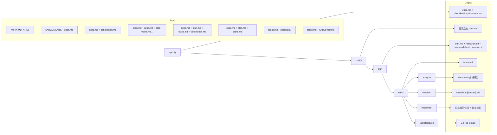

# Command-Templates

# Command-Templates 模块文档

> **Command-Templates** 是 Speckit 工作流的核心控制平面，定义了一组可组合、语义明确、上下文感知的命令模板。每个模板封装了特定工程阶段（需求→规划→任务→分析→实施→交付）的完整执行协议，确保跨角色、跨工具链的一致性与可追溯性。

---

## 一、模块定位与设计哲学

### 核心目的
- **标准化工程决策流**：将模糊的“做功能”转化为结构化、可审计、可中断/恢复的原子操作序列。
- **强制质量门控**：在每个关键交接点（如 `spec → plan`、`plan → tasks`）嵌入自动验证与一致性检查。
- **解耦意图与实现**：用户只需声明 *what*（例如“我要加登录”），模板负责推导 *how*（技术选型、任务分解、检查清单）并确保 *why*（章程对齐、质量维度覆盖）不被稀释。

### 设计原则
| 原则 | 体现方式 | 示例 |
|------|----------|------|
| **只读优先** | 分析类命令（`analyze`, `checklist`）禁止文件写入，仅输出报告 | `analyze.md` 明确要求“严格只读”，修复需用户显式授权 |
| **章程即宪法** | 所有分析、生成、验证均以 `/memory/constitution.md` 为最高权威 | `analyze.md` 将章程冲突自动标记为 **严重** 问题 |
| **渐进式上下文加载** | 避免全文解析，按需提取最小必要片段（如仅 spec 的“功能需求”段） | `clarify.md` 仅扫描模糊性类别，不加载整份 spec |
| **需求即测试** | `checklist.md` 的核心范式：清单不是测代码，而是测需求本身的质量 | ✅ “是否量化了‘快速’？” vs ❌ “是否点击后3秒内响应？” |
| **确定性可重现** | ID 生成（A1, CHK001, T001）、路径推导、严重性分级均基于稳定规则 | `analyze.md` 要求“无更改重新运行应产生一致的 ID 和计数” |

---

## 二、命令模板全景图

下图展示了各命令在 Speckit 工作流中的位置、依赖关系及数据流向：

> 💡 **关键洞察**：所有命令均以 `FEATURE_DIR` 为工作根目录，通过统一的前置脚本（`check-prerequisites.sh/.ps1`）解析环境，确保跨平台、跨 shell 的行为一致性。

---

## 三、核心模板详解

### 1. `specify.md` —— 需求捕获的起点  
**作用**：将用户口语化描述转化为结构化、可验证的功能规范（`spec.md`）。  
**关键机制**：
- **智能分支命名**：从描述中提取关键词（如 `"add user auth"` → `user-auth`），结合现有分支编号自动生成唯一分支（`1-user-auth`）。
- **NEEDS CLARIFICATION 机制**：最多允许 3 处模糊点，以表格形式向用户呈现选项（A/B/C），强制关键决策显性化。
- **质量守门员**：自动生成 `checklists/requirements.md`，验证规范是否满足“无实现细节”“可测试”“范围明确”等 12 项标准。

### 2. `clarify.md` —— 模糊性清除器  
**作用**：在规划前，精准识别并固化规范中未决的高影响决策。  
**关键机制**：
- **九维模糊扫描**：覆盖功能范围、数据模型、UX 流程、非功能属性等 9 类领域，为每类标记 `清晰/部分/缺失`。
- **五问上限策略**：按 `(影响 × 不确定性)` 排序，仅提问前 5 个能显著降低返工风险的问题。
- **增量写入**：每个答案立即追加到 `## Clarifications` 区，并同步更新对应章节（如数据模型、NFR），避免状态漂移。

### 3. `plan.md` —— 技术契约生成器  
**作用**：基于规范与章程，产出技术设计制品（`plan.md`, `data-model.md`, `contracts/`）。  
**关键机制**：
- **Research-Driven Design**：将 `NEEDS CLARIFICATION` 自动转为 `research.md` 中的研究任务（如 “Research OAuth2 token storage for mobile”）。
- **章程检查嵌入**：在 `plan.md` 中强制包含 `## Constitution Checks` 章节，逐条验证技术选型是否符合章程 MUST/SHOULD。
- **代理上下文同步**：自动调用 `update-agent-context.sh/.ps1`，将新引入的技术栈（如 Next.js）注入 AI 代理的上下文，确保后续任务理解技术约束。

### 4. `tasks.md` —— 可执行任务编排器  
**作用**：将设计制品转化为机器可读、人类可理解的 `tasks.md`。  
**关键机制**：
- **故事驱动组织**：严格按 `spec.md` 中的用户故事（US1/US2）分阶段，每个故事阶段包含独立测试标准。
- **零歧义格式规范**：强制 `-[ ] T001 [P] [US1] 描述 @path/to/file`，缺失任一元素即报错。
- **并行安全标记**：仅当任务操作不同文件且无数据依赖时才添加 `[P]`，杜绝竞态条件。

### 5. `analyze.md` —— 跨制品一致性审计员  
**作用**：在 `tasks.md` 生成后，对 `spec.md`/`plan.md`/`tasks.md` 进行非破坏性一致性分析。  
**关键机制**：
- **语义模型构建**：内部构建 `需求清单`（slug 化键）、`任务覆盖映射`、`章程规则集`，脱离原始文本进行比对。
- **六维检测引擎**：  
  - **重复**（近似需求合并）  
  - **模糊性**（“robust”, “intuitive” 等未量化词）  
  - **规范不足**（动词无宾语：“enable search” → 缺少“what to search”）  
  - **章程对齐**（MUST 原则冲突即严重）  
  - **覆盖缺口**（无任务的需求 / 无需求的任务）  
  - **不一致性**（术语漂移、引用缺失、冲突需求）  
- **严重性启发式**：章程违规 > 零覆盖需求 > 重复/冲突 > 术语漂移 > 风格问题。

### 6. `checklist.md` —— 需求质量单元测试套件  
**作用**：为任意领域（UX/API/Security）生成“测试需求而非实现”的检查清单。  
**关键机制**：
- **九维质量框架**：每个清单项目必属 `完整性/清晰度/一致性/验收标准质量/场景覆盖度/边缘情况/非功能/依赖/歧义` 之一。
- **绝对禁止模式**：禁用 “Verify”, “Test”, “Confirm” 等动词；禁用 “click”, “render”, “load” 等实现行为词。
- **可追溯性硬约束**：≥80% 的项目必须含 `[Spec §X.Y]` 或 `[Gap]`/`[Ambiguity]` 标记，确保每个问题可定位。

### 7. `implement.md` —— 安全执行引擎  
**作用**：按 `tasks.md` 顺序执行，集成检查清单门控与环境验证。  
**关键机制**：
- **清单门控**：执行前扫描 `checklists/*.md`，任何未完成项（`- [ ]`）即暂停并询问用户。
- **智能 ignore 文件管理**：根据 `plan.md` 技术栈（Node/Python/Go...）和存在文件（Dockerfile, `.eslintrc`）动态生成/验证 `.gitignore`, `.dockerignore` 等。
- **TDD 强制流程**：若 `tasks.md` 含测试任务，则必须在对应实现任务前执行。

### 8. `taskstoissues.md` —— GitHub 议题桥接器  
**作用**：将 `tasks.md` 中的任务一键转换为 GitHub Issues，支持团队协作。  
**关键机制**：
- **远程仓库校验**：仅当 `git config --get remote.origin.url` 返回 GitHub URL 时才执行，防止误发至其他平台。
- **MCP 协议集成**：通过 `github-mcp-server/issue_write` 工具创建议题，确保与 GitHub API 兼容。
- **任务到议题映射**：每个 `- [ ] T001 ...` 生成一个 Issue，标题为 `T001: [描述]`，正文含文件路径与上下文。

### 9. `constitution.md` —— 项目治理中枢  
**作用**：维护 `/memory/constitution.md`，确保所有模板与章程实时同步。  
**关键机制**：
- **占位符驱动更新**：识别 `[PROJECT_NAME]`, `[PRINCIPLE_1_NAME]` 等模板槽位，用用户输入或上下文推导值填充。
- **语义版本自动递增**：根据变更类型（新增原则=MINOR，删除 MUST=MAJOR）自动更新 `CONSTITUTION_VERSION`。
- **传播式一致性检查**：修改章程后，自动扫描 `plan-template.md`, `spec-template.md`, `tasks-template.md` 及所有 `commands/*.md`，报告需更新的文件。

---

## 四、与代码库的集成关系

### 关键依赖路径
| 组件 | 位置 | 说明 |
|------|------|------|
| **前置脚本** | `scripts/bash/check-prerequisites.sh` `scripts/powershell/check-prerequisites.ps1` | 所有命令的入口，统一解析 `FEATURE_DIR`, `AVAILABLE_DOCS`, `BRANCH` |
| **模板文件** | `templates/spec-template.md` `templates/plan-template.md` `templates/tasks-template.md` | `specify`/`plan`/`tasks` 命令的结构骨架，`constitution.md` 修改后需同步 |
| **章程文件** | `/memory/constitution.md` | 全局权威，`analyze`/`plan`/`constitution` 命令直接读取 |
| **检查清单目录** | `FEATURE_DIR/checklists/` | `checklist` 命令输出目标，`implement` 命令执行前校验点 |
| **制品目录** | `FEATURE_DIR/spec.md` `FEATURE_DIR/plan.md` `FEATURE_DIR/tasks.md` | 命令间传递的核心制品，构成工作流数据主线 |

### 数据流契约
- **输入稳定性**：所有命令接受 `$ARGUMENTS`，但仅 `specify`/`clarify`/`constitution` 将其作为主要输入；其余命令聚焦于制品文件。
- **路径确定性**：`FEATURE_DIR` 由前置脚本推导，所有文件路径均为绝对路径，消除相对路径歧义。
- **错误处理契约**：任何命令失败时，必须输出清晰的 `ERROR:` 前缀消息，并给出可操作的下一步（如 “Run `/speckit.specify` first”）。

---

## 五、最佳实践与反模式

### ✅ 推荐实践
- **尽早运行 `analyze`**：在 `tasks.md` 生成后立即执行，捕获跨制品不一致，避免后期返工。
- **为每个领域生成专属 checklist**：`/speckit.checklist --domain ux` → `checklists/ux.md`，`--domain security` → `checklists/security.md`。
- **利用 `clarify` 减少下游噪音**：在 `plan` 前解决 5 个关键模糊点，比在 `implement` 阶段发现架构缺陷节省 10x 时间。
- **章程更新后必跑 `constitution`**：确保 `plan-template.md` 中的 `## Constitution Checks` 与最新章程匹配。

### ❌ 严格禁止
- **跳过 `checklist` 直接 `implement`**：`implement.md` 会主动拒绝，除非用户明确确认 `yes`。
- **手动编辑 `tasks.md` 后不运行 `analyze`**：可能引入 `spec`/`plan`/`tasks` 三者间的静默不一致。
- **在 `spec.md` 中写实现细节**：`specify.md` 的质量检查会失败，并提示 “Remove implementation details (e.g., 'React', 'PostgreSQL')”。
- **修改 `constitution.md` 后不更新模板**：导致 `plan.md` 中的章程检查引用过时原则，产生虚假警报。

---

## 六、扩展与定制

### 自定义模板
- 所有命令模板位于 `templates/commands/`，可安全修改（如调整 `analyze.md` 的严重性阈值）。
- 新增命令只需：  
  1. 创建 `templates/commands/mycmd.md`  
  2. 在 `description` 中声明用途  
  3. 遵循 `{SCRIPT}` 调用与 `$ARGUMENTS` 处理约定  
  4. 加入 `handoffs` 定义下游跳转  

### 集成外部工具
- `taskstoissues.md` 通过 MCP（Model Context Protocol）调用 `github-mcp-server`，可替换为 Jira、Linear 等 MCP 兼容服务。
- `implement.md` 的 ignore 文件逻辑可通过修改 `scripts/bash/setup-plan.sh` 扩展新语言支持。

---

> **总结**：Command-Templates 不是脚本集合，而是一套**工程协议层**。它将软件开发中易变、主观、易出错的环节（需求澄清、技术选型、任务分解）转化为可编程、可验证、可审计的确定性流程。开发者专注 *what*，模板保障 *how* 与 *why* 的正确性。