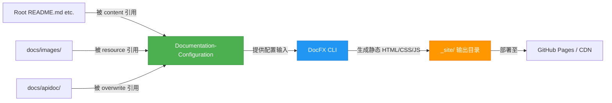

# Documentation-Configuration

# Documentation-Configuration 模块文档

`Documentation-Configuration` 是 **Spec Kit CN** 项目中负责驱动静态文档站点构建与呈现的核心配置模块。它不包含可执行逻辑或运行时代码，而是通过声明式配置文件（主要是 `docfx.json` 和 `toc.yml`）定义文档内容源、组织结构、渲染行为及元数据策略，为 [DocFX](https://dotnet.github.io/docfx/) 文档生成工具提供完整输入。

该模块是整个项目**技术文档交付链路的起点与控制中心**，直接决定开发者和用户所见文档网站的结构、样式、搜索能力、贡献入口及多源内容整合方式。

---

## 🎯 模块目的

本模块旨在：

- ✅ **统一管理文档源**：聚合项目根目录下的通用文档（如 `README.md`、`CONTRIBUTING.md`）与 `docs/` 子目录下的专用文档。
- ✅ **定义导航结构**：通过 `toc.yml` 显式声明文档层级（Home → Getting Started → Development），确保网站具备清晰、可预测的浏览路径。
- ✅ **定制化文档站点行为**：配置主题、搜索、Git 贡献链接、元数据、资源路径等，使生成的 `_site/` 输出符合 Spec Kit CN 的品牌与交互规范。
- ✅ **支持增量与可维护性**：分离内容（`.md`）、结构（`toc.yml`）与构建逻辑（`docfx.json`），便于团队协作编辑与 CI/CD 集成。

> ⚠️ 注意：此模块**不参与应用运行时**，也不被任何其他模块“导入”或调用。它是纯基础设施配置，仅在文档构建阶段（如 `docfx build`）被 DocFX 工具读取并执行。

---

## 🧩 关键组件详解

### 1. `docfx.json` —— 构建引擎的主配置文件

这是 DocFX 的核心配置，采用 JSON 格式，分为多个关键区块：

#### `build.content`
定义**文档内容源**及其目标路径：
```json
"content": [
  { "files": ["*.md", "toc.yml"] }, // docs/ 下的本地文档 + 导航定义
  {
    "files": ["../README.md", "../CONTRIBUTING.md", ...],
    "dest": "." // 将这些根级文档复制到 _site/ 根目录，使其可直接访问（如 /README.html）
  }
]
```
✅ 效果：实现跨目录内容复用，避免文档碎片化。

#### `build.resource`
定义**静态资源**（图片、图标等）的来源与发布路径：
```json
"resource": [
  { "files": ["images/**"] }, // docs/images/ → _site/images/
  { "files": ["../media/**"], "dest": "media" } // 项目根 media/ → _site/media/
]
```
✅ 效果：支持文档中使用相对路径引用图片（如 ``），且资源自动归位。

#### `build.overwrite`
指定**API 文档覆盖规则**（用于后续集成 `docfx metadata` 生成的 API 参考）：
```json
"overwrite": [
  {
    "files": ["apidoc/**.md"],
    "exclude": ["obj/**", "_site/**"]
  }
]
```
✅ 效果：预留扩展点——未来可通过 `docfx metadata` 自动生成 C# 或 TypeScript 的 API 文档，并用此配置将其注入到最终站点中，覆盖默认描述。

#### `build.dest` & `build.template`
- `"dest": "_site"`：指定构建输出目录（默认，可被 CLI 参数覆盖）。
- `"template": ["default", "modern"]`：启用 DocFX 官方 `default` 主题 + 社区增强的 `modern` 主题（提供更现代的 UI、暗色模式支持等）。

#### `build.globalMetadata`
全局元数据，直接影响页面渲染与功能：
```json
"globalMetadata": {
  "_appTitle": "Spec Kit CN 文档",
  "_appName": "Spec Kit CN",
  "_appFooter": "Spec Kit CN - 规范驱动开发工具包",
  "_enableSearch": true,
  "_disableContribution": false,
  "_gitContribute": {
    "repo": "https://github.com/Linfee/spec-kit-cn",
    "branch": "main"
  }
}
```
✅ 效果：
- 页面 `<title>`、页眉标题、页脚文案均由其驱动；
- 启用 Algolia 或内置 Lucene 搜索（取决于模板）；
- 每个文档页右上角显示 “Edit this page on GitHub” 按钮，直链至对应 `.md` 文件的编辑界面。

#### 其他重要开关
| 配置项 | 值 | 说明 |
|--------|----|------|
| `markdownEngineName` | `"markdig"` | 使用高性能 Markdown 解析器，支持扩展语法（表格、脚注、数学公式等） |
| `keepFileLink` | `false` | 禁用原始文件下载链接（避免暴露未渲染的 `.md` 源） |
| `disableGitFeatures` | `false` | 启用 Git 提交信息展示（如最后更新时间、作者） |

---

### 2. `toc.yml` —— 文档站点的导航骨架

YAML 格式的树形结构，严格定义左侧导航栏（Table of Contents）的层级与顺序：

```yaml
- name: Home
  href: index.md

- name: Getting Started
  items:
    - name: Installation
      href: installation.md
    - name: Quick Start
      href: quickstart.md
    - name: Upgrade
      href: upgrade.md

- name: Development
  items:
    - name: Local Development
      href: local-development.md
```

✅ 特性：
- `href` 必须指向 `content` 中已声明的 `.md` 文件（否则构建报错）；
- 支持无限嵌套 `items`，但当前仅用两级满足 MVP 需求；
- `name` 字段支持中文，与 `_appTitle` 等元数据共同构成本地化体验基础。

> 💡 提示：`toc.yml` 中的 `index.md` 是站点首页，需确保其存在于 `docs/` 目录下，且包含有效 Markdown 内容（如摘要、快速链接、版本徽章等）。

---

## 🔗 与代码库其他部分的关系

本模块处于整个项目文档交付流水线的**顶层配置层**，与其他模块呈**单向依赖关系**（无反向调用）：



- **无运行时耦合**：前端应用、CLI 工具、SDK 库等均不 import 或 require 此模块的任何文件。
- **CI/CD 集成点**：在 `.github/workflows/docs.yml` 等工作流中，会执行 `docfx build` 命令，读取本模块配置，触发构建 → 部署流程。
- **开发协同接口**：贡献者只需编辑 `.md` 文件或 `toc.yml`，即可影响线上文档；无需了解 DocFX 内部机制。

---

## 🛠️ 维护与扩展指南

### ✅ 推荐实践
- 新增文档页：  
  1. 在 `docs/` 下创建 `xxx.md`；  
  2. 在 `toc.yml` 对应位置添加新条目（保持语义化命名与合理层级）；  
  3. 提交 PR，CI 自动验证并预览。

- 更新品牌信息：  
  修改 `docfx.json` 中 `globalMetadata` 下的 `_appTitle`、`_appFooter` 等字段。

- 添加新资源（如 SVG 图标、截图）：  
  放入 `docs/images/` 或项目根 `media/`，并在 Markdown 中用 `` 或 `` 引用。

### ⚠️ 注意事项
- `docfx.json` 中路径均为**相对于 `docfx.json` 文件自身的位置**（即 `docs/` 目录）。
- `toc.yml` 中的 `href` 是**相对于 `docs/` 的路径**，不加前导 `/`。
- 修改 `template` 后需确认所选主题已安装（`docfx template install modern`）。
- `overwrite` 区块目前为空占位，待接入 API 文档生成后才启用；提前放置可避免后期配置遗漏。

---

## 📚 相关资源

- [DocFX 官方文档](https://dotnet.github.io/docfx/)
- [DocFX 配置参考（docfx.json）](https://dotnet.github.io/docfx/reference/docfx-json.html)
- [TOC YAML 格式说明](https://dotnet.github.io/docfx/tutorial/intro_toc.html)
- [Modern 主题 GitHub 仓库](https://github.com/ekonbenefits/docfx-theme-modern)

--- 

✅ 本模块虽小，却是 Spec Kit CN **可发现性、可维护性与专业性的基石**。每一次对 `toc.yml` 的梳理、对 `docfx.json` 的精调，都在提升开发者接触与理解本项目的效率。