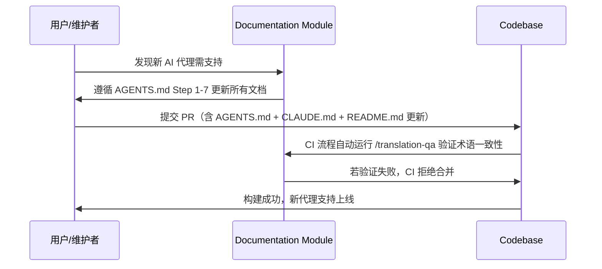

# Documentation

# Documentation 模块文档

> **模块定位**：`Documentation` 并非一个独立的 Python 包或代码模块，而是 Spec Kit CN 项目中**以文档为中心的元治理系统**——它是一组相互关联、协同演进的 Markdown 文档集合，共同构成项目的**知识基座（Knowledge Base）**、**开发契约（Development Contract）** 和**本地化操作手册（Localization Playbook）**。

该模块不包含可执行逻辑，但其内容直接驱动 CLI 行为、约束 AI 助手输出、指导开发者实践，并在技术层面被构建脚本、上下文更新工具和发布流程所解析与依赖。

---

## 🎯 核心目的与价值

`Documentation` 模块解决 Spec Kit CN 项目中最关键的三重挑战：

| 挑战 | 解决方案 | 对应文档 |
|------|----------|----------|
| **功能对等性风险**<br>中文版易因翻译偏差导致 CLI 行为异常、模板失效或 AI 助手无法识别命令 | 建立**不可翻译的技术标记规范**与**路径/命令处理准则**，确保所有自动化流程（如 `update-agent-context.sh`）严格依赖原始英文结构 | `TRANSLATION_STANDARDS.md`<br>`TERMINOLOGY.md` |
| **AI 助手集成碎片化**<br>新增 AI 代理需同步修改 CLI、脚本、README、Devcontainer 等 10+ 处，极易遗漏 | 提供**标准化的 Agent 集成指南**，将 AGENT_CONFIG 字典定义为唯一事实源，并明确各环节的更新步骤与校验点 | `AGENTS.md`（核心集成规范） |
| **本地化工作流不可持续**<br>人工翻译易导致术语不一致、路径错误、技术标记误译，引发 CI 失败或用户困惑 | 定义**分层质量保障体系**：术语表 → 翻译标准 → QA 流程 → 自动化检查，使 90%+ 翻译任务可由 `/translation-*` 命令自动完成 | `TERMINOLOGY.md`<br>`TRANSLATION_STANDARDS.md`<br>`CLAUDE.md`（工作流入口） |

> ✅ **本质**：`Documentation` 是 Spec Kit CN 的**活体架构图（Living Architecture Diagram）** —— 它不描述系统，它 *就是* 系统的约束与协议。

---

## 🧩 关键组件与职责

以下文档构成 `Documentation` 模块的核心支柱，按**抽象层级**从高到低组织：

### 1. `AGENTS.md` —— AI 代理集成的“宪法”
- **角色**：Spec Kit CN 支持所有 AI 助手的**权威技术规范**与**集成契约**
- **核心内容**：
  - ✅ `AGENT_CONFIG` 字典的完整定义（含 CLI 工具名、目录路径、安装 URL、`requires_cli` 标志）
  - ✅ 新代理接入的**7 步标准化流程**（从字典更新到 Devcontainer 配置）
  - ✅ **关键设计原则**：强制使用实际 CLI 工具名作为字典键（如 `"cursor-agent"` 而非 `"cursor"`），消除映射歧义
  - ✅ 代理分类（CLI-based vs IDE-based）、命令格式（Markdown/TOML）、参数占位符（`$ARGUMENTS` / `{{args}}`）的精确约定
- **技术影响**：
  - `src/specify_cli/__init__.py` 中的 `init()` 和 `check()` 命令直接遍历 `AGENT_CONFIG`
  - `.github/workflows/scripts/create-release-packages.sh` 的 `case` 语句据此生成目录结构
  - `scripts/bash/update-agent-context.sh` 依据 `AGENT_CONFIG` 中的 `folder` 字段定位规则文件

### 2. `CLAUDE.md` —— 项目记忆与本地化工作流的“中枢神经”
- **角色**：Spec Kit CN 的**项目级记忆文件**与**自动化翻译工作流总控台**
- **核心内容**：
  - ✅ 项目标识（包名 `specify-cn-cli`、命令 `specify-cn`、同步策略）
  - ✅ **自动化翻译工作流指令集**：`/translation-auto`, `/translation-sync`, `/translation-qa` 等斜杠命令的语义与执行目标
  - ✅ 同步策略（“核心同步，界面本地化”）与文件分类处理矩阵（哪些文件必须同步、哪些需完全翻译）
  - ✅ 开发环境配置（`.devcontainer/`）的同步与不翻译原则
- **技术影响**：
  - 所有 `/translation-*` 命令的实现逻辑均隐式依赖此文件定义的范围与规则
  - `CHANGELOG.md` 的维护原则在此明确定义（独立维护，记录原版同步信息）
  - 是 `TERMINOLOGY.md` 和 `TRANSLATION_STANDARDS.md` 的上层引用锚点

### 3. `TERMINOLOGY.md` —— 术语一致性的“词典与法典”
- **角色**：Spec Kit CN 全局术语翻译的**唯一权威来源**与**技术标记防火墙**
- **核心内容**：
  - ✅ **四类术语表**：产品品牌、技术概念、开发工具、用户界面（共 150+ 条目）
  - ✅ **不可翻译技术标记清单**：`NEEDS CLARIFICATION`, `N/A`, `TODO`, `TKTK`, `???` —— 明确声明其为脚本依赖，**任何翻译即导致构建失败**
  - ✅ **特殊规则**：中英文混排空格规范、路径/斜杠命令处理准则（禁止手动添加 `.specify/` 前缀）
- **技术影响**：
  - `TRANSLATION_STANDARDS.md` 中的“术语处理标准”章节直接引用此文件
  - `scripts/bash/update-agent-context.sh` 等脚本的 `grep` 过滤逻辑依赖 `NEEDS CLARIFICATION` 等标记的**精确英文字符串**
  - 所有翻译审查（QA）流程均以本文件为黄金标准进行比对

### 4. `TRANSLATION_STANDARDS.md` —— 翻译质量的“SOP 与质检清单”
- **角色**：Spec Kit CN 翻译工作的**标准操作程序（SOP）** 与**自动化质量门禁（Quality Gate）**
- **核心内容**：
  - ✅ **翻译范围白名单/黑名单**（如 `AGENTS.md` 必须同步不翻译，`README.md` 必须全量翻译）
  - ✅ **混合型文档处理规则**：`templates/commands/checklist.md` 中 YAML Front Matter 与 Generation Algorithm 必须保留英文，仅翻译用户说明
  - ✅ **严重错误分级**：功能错误、信息缺失、术语错误为必须修复项；术语不一致为建议修复项
  - ✅ **输出报告结构**：为 `/translation-qa` 命令生成结构化审查报告提供模板
- **技术影响**：
  - `/translation-qa` 命令的实现逻辑直接解析此文件中的检查项（如“路径是否手动添加 `.specify/` 前缀”）
  - 是 `docs/` 目录下所有文档翻译的强制遵循标准

### 5. `README.md` & `docs/` —— 用户可见的“产品说明书”与“开发者手册”
- **角色**：面向终端用户的**功能概览**与面向贡献者的**深度技术指南**
- **核心内容**：
  - ✅ `README.md`：快速入门、CLI 参考、支持的 AI 代理列表（实时同步 `AGENTS.md` 内容）、故障排除
  - ✅ `docs/`：`installation.md`, `quickstart.md`, `upgrade.md`, `local-development.md` —— 分场景、分角色的实操指南
- **技术影响**：
  - `README.md` 中的 `--ai` 参数列表必须与 `AGENTS.md` 中的 `AGENT_CONFIG` 键完全一致
  - `docs/upgrade.md` 中的 `--force` 行为警告直接源于 `CLAUDE.md` 定义的“章程文件将被覆盖”已知问题
  - 所有 CLI 示例命令（如 `specify-cn init --ai claude`）是 `AGENTS.md` 中 CLI 工具名约定的直接体现

---

## 🔗 与代码库的集成关系

`Documentation` 模块通过**显式引用**与**隐式依赖**两种方式深度嵌入整个代码库：

### 显式引用（代码直接读取文档内容）
```mermaid
graph LR
    A[AGENT_CONFIG in src/specify_cli/__init__.py] -->|读取| B[AGENTS.md]
    C[update-agent-context.sh] -->|grep| D["NEEDS CLARIFICATION\nN/A\nTODO"]
    D --> E[TERMINOLOGY.md]
    F[/translation-* commands] -->|执行逻辑| G[CLAUDE.md]
    G -->|引用| H[TRANSLATION_STANDARDS.md]
    H -->|引用| E
```

### 隐式依赖（文档定义规则，代码按规则实现）
- `src/specify_cli/__init__.py` 中的 `init()` 函数：
  - 依据 `AGENTS.md` 的 `AGENT_CONFIG` 自动生成 `--ai` 参数帮助文本
  - 依据 `TERMINOLOGY.md` 的“命令替换规则”，将 `specify` 替换为 `specify-cn`
- 发布脚本 `create-release-packages.sh`：
  - 依据 `AGENTS.md` 的 `folder` 字段创建 `.windsurf/workflows/` 等目录
  - 依据 `TRANSLATION_STANDARDS.md` 的“路径处理准则”，在 `rewrite_paths` 函数中统一添加 `.specify/` 前缀
- `docs/upgrade.md` 中的 `--no-git` 行为说明：
  - 直接反映 `src/specify_cli/__init__.py` 中 `init()` 函数对该标志的实现逻辑

---

## 🛠️ 使用与维护指南

### ✅ 正确使用方式
1. **新增 AI 代理**：严格遵循 `AGENTS.md` 中的“Step-by-Step Integration Guide”，**第一步永远是更新 `AGENT_CONFIG` 字典**
2. **翻译新文件**：先查 `TERMINOLOGY.md`，再按 `TRANSLATION_STANDARDS.md` 执行，最后用 `/translation-qa` 验证
3. **升级项目**：运行 `specify-cn init --here --force --ai <your-agent>`，并按 `docs/upgrade.md` 的警告处理 `constitution.md`
4. **调试 CLI 行为**：当 `specify-cn check` 报告某工具缺失时，检查 `AGENTS.md` 中该代理的 `requires_cli` 值是否为 `True`

### ⚠️ 严禁操作（会导致构建/运行失败）
- ❌ 在 `TERMINOLOGY.md` 中翻译 `NEEDS CLARIFICATION` 等技术标记
- ❌ 在 `README.md` 或 `docs/` 中手动为路径添加 `.specify/` 前缀（应由发布脚本自动处理）
- ❌ 修改 `AGENTS.md` 中 `AGENT_CONFIG` 的键名（如将 `"cursor-agent"` 改为 `"cursor"`）
- ❌ 在 `TRANSLATION_STANDARDS.md` 的“混合型文档”规则外，翻译 YAML Front Matter 或算法描述

### 🔄 维护生命周期


---

## 📚 总结：Documentation 模块的本质

`Documentation` 不是“写给人看的说明书”，而是：

- **给机器读的配置文件**：`AGENT_CONFIG` 是 CLI 的配置源，`NEEDS CLARIFICATION` 是脚本的开关。
- **给 AI 用的提示工程**：`templates/commands/` 中的 Markdown/TOML 文件是向 Claude/Gemini 等模型注入结构化思维的 Prompt 模板。
- **给团队定的协作契约**：`TERMINOLOGY.md` 和 `TRANSLATION_STANDARDS.md` 消除了“这个术语该怎么翻”的争论，让协作聚焦于技术本身。
- **给项目续命的基因库**：`CLAUDE.md` 中的同步策略与 `docs/upgrade.md` 中的升级指南，确保 Spec Kit CN 能随原版 Spec Kit 持续进化而不失血。

> **一句话定义**：  
> **`Documentation` 是 Spec Kit CN 的操作系统内核——它不运行代码，但它定义了所有代码如何被编写、如何被集成、如何被翻译、以及如何被正确理解。**