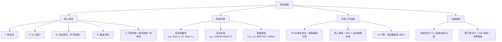

# Memory

# Memory 模块文档

## 概述

`Memory` 模块**并非一个功能实现模块，而是一个项目治理与协作契约的载体**。它不包含任何可执行代码、数据结构或运行时逻辑，其唯一职责是**定义并固化整个项目的工程实践共识**——即《[PROJECT_NAME] 项目章程》（`memory/constitution.md`）。

该模块名称 `Memory` 是一种隐喻：它代表项目集体记忆（Collective Memory）的持久化存储，确保核心原则、约束条件和治理规则不会随人员流动、迭代演进而模糊或丢失。

> ✅ **关键事实**：  
> - `memory/constitution.md` 是本模块的**唯一源文件**；  
> - 它**不被任何其他模块导入、调用或执行**（见 Call Graph：无内部/外部调用，无执行流）；  
> - 它的“生效”方式是**人工阅读、对齐、审查与遵循**，而非程序化加载。

---

## 核心目的

| 维度 | 说明 |
|------|------|
| **对齐共识** | 为所有贡献者（开发者、PM、QA、运维）提供一份权威、稳定、版本化的“工程宪法”，避免因理解偏差导致重复造轮、测试缺失、可观测性不足等问题。 |
| **降低认知负荷** | 新成员可通过阅读章程快速掌握项目设计哲学（如“库优先”“测试不可协商”），无需从零逆向推导团队习惯。 |
| **支撑质量门禁** | 章程中明确的规则（如“TDD 强制要求”“集成测试重点领域”）直接转化为 CI/CD 流水线中的检查项（例如：PR 必须关联测试用例、`cargo test --lib` 必须通过）。 |
| **治理锚点** | 当出现技术争议（如是否引入新框架、是否跳过某类测试）时，章程是裁决依据；任何变更需走正式修订流程（文档化 + 批准 + 迁移计划）。 |

---

## 关键内容结构解析

`memory/constitution.md` 采用分层结构，覆盖从价值观到操作细则的全栈治理：

> 💡 **注意**：图中示例内容（如 `Rust ≥1.75`, `P95 < 200ms`）需根据实际 `constitution.md` 中的 `[SECTION_2_CONTENT]` 和 `[SECTION_3_CONTENT]` 替换为真实条目。

---

## 与其他模块的关系

`Memory` 模块在架构中处于**元层级（Meta-layer）**，不参与数据流或控制流，但为所有其他模块提供**隐式约束与显式指导**：

| 关联方向 | 说明 | 示例体现 |
|----------|------|-----------|
| **向上：指导产品/Spec 模块** | 章程中“库优先”“CLI 接口”原则，直接决定 `spec/` 下每个功能是否应拆分为独立 crate、是否必须提供 `--json` 输出等。 | `spec/taskflow.md` 要求所有任务编排能力必须通过 `taskflow-cli` 提供 CLI 入口。 |
| **横向：约束实现模块（如 `core/`, `cli/`, `test/`）** | “测试优先”“集成测试”原则，强制 `core/` 模块必须提供 `#[cfg(test)]` 单元测试，`test/integration/` 目录必须覆盖跨 crate 调用场景。 | `core/executor.rs` 的 PR 被拒绝，因未同步更新 `test/integration/executor_e2e.rs`。 |
| **向下：赋能可观测性/部署模块** | “可观测性”原则要求所有日志必须含 `trace_id` 和结构化字段，驱动 `observability/logging/` 模块统一日志格式器开发。 | `observability/logging/src/formatter.rs` 的 `JsonFormatter` 实现直接受章程 V 条款约束。 |

> ⚠️ **重要提醒**：这种关系是**规范性（Normative）而非依赖性（Dependency）**。`core/` 模块的源码中**不会 import `memory::constitution`**，但其设计与提交行为必须符合章程。

---

## 使用与维护指南

### ✅ 正确使用方式
- **新人入职**：将 `memory/constitution.md` 列为必读文档（与 `README.md` 同级）；
- **PR 提交**：在描述中注明所遵循的章程条款（如 `Fixes #123; aligns with III. 测试优先`）；
- **技术评审**：将章程作为 checklist —— 例如评审 CLI 工具时，必须验证是否支持 `--json` 和 `--help`。

### 🛠️ 维护流程（章程修订）
1. **提案**：提交 RFC（`rfcs/00XX-constitution-update.md`），说明变更原因、影响范围、迁移步骤；
2. **讨论**：在 `#governance` 频道或周会中达成共识；
3. **批准**：由 Tech Lead + 2 名 SIG Maintainers 签署批准；
4. **发布**：更新 `constitution.md`，提交 PR 并标注 `[GOVERNANCE]`，自动触发 `docs/ci-check-constitution` 检查（验证版本号、日期格式）；
5. **同步**：更新 `CONTRIBUTING.md` 中的“如何参与治理”章节，并邮件通知全体成员。

### ❌ 禁止行为
- 在代码中硬编码绕过章程约束（如为赶进度注释掉测试）；
- 在未更新章程的情况下，私自扩大技术栈（如引入 Python 脚本）；
- 将章程条款解释为“建议”而非“强制要求”。

---

## 版本与合规性

- **版本号**：遵循 `MAJOR.MINOR.PATCH`，与项目主版本解耦（章程可独立演进）；
- **合规验证**：CI 流水线中运行 `scripts/validate-constitution.sh`，校验：
  - `CONSTITUTION_VERSION` 格式（`^\d+\.\d+\.\d+$`）；
  - `RATIFICATION_DATE` 和 `LAST_AMENDED_DATE` 为有效 ISO 8601 日期；
  - 所有 `[PRINCIPLE_X_NAME]` 占位符已被真实名称替换（防遗漏）；
- **审计追踪**：每次 `constitution.md` 提交必须关联 Jira/GitHub Issue（如 `GOV-42`），记录决策背景。

---

> 📜 **结语**：`Memory` 模块是项目工程文化的“写入式 ROM”——它不运行，但定义了什么值得运行；它不计算，但决定了计算的边界与意义。尊重 `memory/constitution.md`，就是尊重这个项目最稀缺的资产：**可预测、可持续、可传承的工程确定性**。