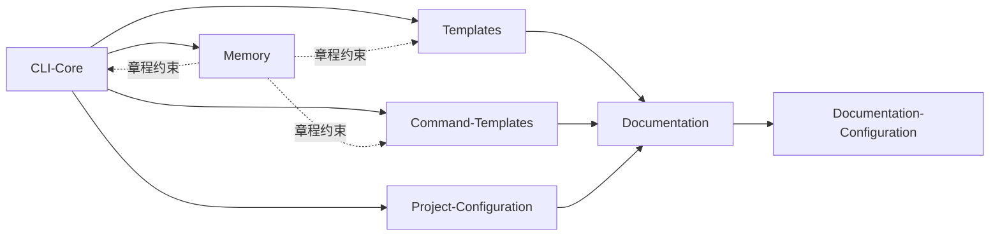

# spec-kit-cn — Wiki

# 🌱 Spec Kit CN — 规范驱动开发（SDD）的中文实践套件

> **更快地构建高质量软件。**  
> 这是一项帮助团队聚焦产品场景、而非重复编写无差异化代码的努力——通过**规范驱动开发（Spec-Driven Development, SDD）**，将需求、设计、实现与验证统一在可执行、可追溯、可协作的规范文档中。

`spec-kit-cn` 是 [GitHub Spec Kit](https://github.com/g) 的官方中文演进分支，核心工具 `specify-cn-cli`（v0.0.90）是一个轻量、健壮、AI 原生的命令行工作流引擎，专为中文技术团队定制：支持双语上下文、本地化模板、跨平台终端交互，并深度集成 Claude、Gemini、Copilot 等 17+ AI 编程助手作为“一等公民”。

---

## 🧩 整体架构概览

Spec Kit CN 不是单体应用，而是一个**以文档为契约、以 CLI 为枢纽、以模板为载体**的协同工程系统。其架构强调「声明优于实现」「文档即配置」「规范即接口」。以下是关键模块及其协作关系（Mermaid 简化视图）：



- `CLI-Core` 是用户交互中枢，响应 `specify-cn init` 等命令，驱动整个工作流；
- `Templates` 与 `Command-Templates` 共同构成「规范生成层」，提供语义化 Markdown 骨架，被 CLI 动态填充；
- `Project-Configuration`（即 `pyproject.toml`）定义项目身份、依赖与构建行为，是工具链可复现性的基石；
- `Documentation` 是知识基座，所有模块的输出（CLI 日志、模板渲染结果、配置说明）最终沉淀于此；
- `Documentation-Configuration` 驱动 DocFX 构建静态文档站，让知识可搜索、可贡献、可版本化；
- `Memory` 是项目的「宪法模块」，以 `memory/constitution.md` 固化工程共识，不参与执行，但约束所有其他模块的设计与行为。

> ✅ 所有模块间**无 Python 层调用依赖**（见参考数据），解耦彻底；协作通过文件系统（读写 `.md` / `.toml`）、约定路径与 CLI 参数完成，保障可维护性与本地化灵活性。

---

## 🚀 核心端到端工作流

当你运行 `specify-cn init`，背后发生的是一个受控、可审计、章程对齐的工程启动流程：

1. **初始化入口**：`CLI-Core` 启动交互式向导（基于 `readchar` + `rich`），引导选择项目类型与 AI 助手；
2. **环境就绪检查**：调用 `check_tool` → `complete` → `_update` → `_maybe_refresh`，自动检测 Git、Python、AI 工具链并提示安装；
3. **模板下载与渲染**：执行 `download_and_extract_template`，从远程仓库拉取对应 `Templates`，结合 `Command-Templates` 填充 `[FEATURE]`、`[DATE]` 等占位符，生成 `SPEC.md`、`PLAN.md`、`CHECKLIST.md` 等规范资产；
4. **章程对齐校验**：全程参照 `Memory` 中的 `constitution.md`，确保生成内容覆盖质量维度（可观测性、测试策略、安全基线等）；
5. **文档站点就绪**：新生成的规范文件自动纳入 `Documentation` 体系，由 `Documentation-Configuration` 配置的 DocFX 流程编译为可浏览的 GitHub Pages 站点（[linfee.github.io/spec-kit-cn](https://linfee.github.io/spec-kit-cn/)）。

该流程可中断、可重入、可审计——每一次 `specify-cn spec` 或 `specify-cn plan` 都是对规范的一次增量演进，而非一次性的脚手架生成。

---

## ⚙️ 快速开始（开发者）

### 安装
```bash
pip install specify-cn-cli==0.0.90
```

### 初始化一个新项目
```bash
specify-cn init --name "my-awesome-app" --feature "用户登录"
```

你将获得：
- 一套符合 `Memory` 章程的规范文档（`SPEC.md`, `PLAN.md`, `CHECKLIST.md`）  
- 适配本地终端与 AI 助手的开发指南（`AGENT-FILE.md`）  
- 自动配置好的 `pyproject.toml`（见 [Project-Configuration](project-configuration.md)）  
- 可立即 `git commit` 并推送的结构化起点  

> 💡 文档即代码，规范即接口。所有产出均位于项目根目录，开箱即用，无需额外配置。

---

## 📚 深入各模块

- 想了解 CLI 如何与 AI 助手协同？→ 查看 [CLI-Core](cli-core.md)  
- 想自定义生成的规范模板？→ 查看 [Templates](templates.md) 和 [Command-Templates](command-templates.md)  
- 想知道文档网站如何构建与更新？→ 查看 [Documentation-Configuration](documentation-configuration.md)  
- 想理解项目治理原则与质量门禁？→ 查看 [Memory](memory.md)  
- 想确认依赖、版本与打包逻辑？→ 查看 [Project-Configuration](project-configuration.md)  
- 想掌握整个知识基座的组织方式？→ 查看 [Documentation](documentation.md)  

欢迎从任意模块切入，它们共同构成 Spec Kit CN 的完整图景：**不是替代开发者，而是放大每一位工程师的判断力与影响力。**