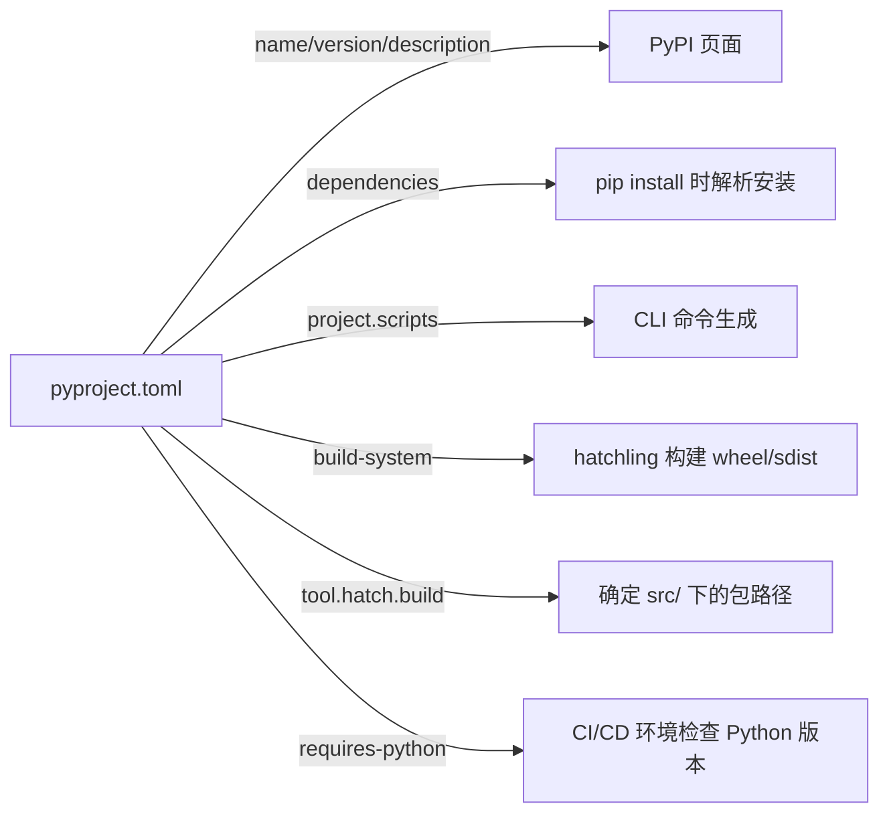

# Project-Configuration

# Project-Configuration 模块文档

## 概述

`Project-Configuration` 模块并非一个独立的 Python 包或代码模块，而是指本项目中 **`pyproject.toml` 文件所定义的构建、元数据与依赖配置体系**。它是整个 `specify-cn-cli` 工具的**项目级声明式配置中枢**，决定了：

- 项目身份（名称、版本、描述）
- 运行环境约束（Python 版本要求）
- 外部依赖关系（运行时依赖）
- 可执行入口（CLI 命令注册）
- 构建行为（打包方式、源码路径）
- 发布与分发规范（wheel 包结构）

该配置是 PEP 517/518 标准的实践，取代了传统的 `setup.py`，为现代 Python 项目提供统一、可复现、工具链友好的工程化基础。

> ✅ **关键定位**：这不是运行时逻辑模块，而是**构建时与安装时的权威配置源**，驱动 `hatchling`、`pip`、`poetry` 等工具的行为。

---

## 核心配置解析

### 1. `[project]` —— 项目元数据与依赖声明

```toml
[project]
name = "specify-cn-cli"
version = "0.0.90"
description = "Specify CN CLI, part of GitHub Spec Kit CN. A tool to bootstrap your projects for Spec-Driven Development (SDD). Corresponds to upstream spec-kit v0.0.90."
requires-python = ">=3.11"
dependencies = [
    "typer",
    "rich",
    "httpx[socks]",
    "platformdirs",
    "readchar",
    "truststore>=0.10.4",
]
```

| 字段 | 说明 |
|------|------|
| `name` | PyPI 包名，也是 `pip install` 时使用的标识符。必须全局唯一。 |
| `version` | 语义化版本号（SemVer），与上游 `spec-kit` 主版本对齐（`v0.0.90`），体现兼容性承诺。 |
| `description` | 简明功能说明，面向用户和包索引（如 PyPI）展示。强调其在 **Spec-Driven Development（SDD）** 生态中的角色——项目初始化工具。 |
| `requires-python` | **强制约束**：仅支持 Python ≥3.11。确保能使用 `typing.Union`、`dataclass_transform` 等新特性，并与依赖库（如 `typer>=0.9.0`）兼容。 |
| `dependencies` | **运行时最小依赖集**：<br>• `typer`: 构建命令行接口（CLI）的核心框架<br>• `rich`: 提供富文本终端输出（高亮、表格、进度条）<br>• `httpx[socks]`: 支持 HTTP(S) + SOCKS 代理的异步/同步 HTTP 客户端（用于远程 Spec 获取）<br>• `platformdirs`: 跨平台获取配置/缓存/数据目录（如 `~/.config/specify-cn/`）<br>• `readchar`: 低层级键盘输入捕获（用于交互式向导，如 `y/n` 选择）<br>• `truststore>=0.10.4`: 自动注入系统根证书到 `httpx`/`requests`，解决企业内网/HTTPS 代理证书信任问题 |

> ⚠️ 注意：无 `optional-dependencies` 或 `dev-dependencies` —— 当前项目将开发依赖（如 `pytest`, `ruff`）置于 `tool.hatch.envs.test` 等工具专有区段，保持 `project.dependencies` 纯净。

---

### 2. `[project.scripts]` —— CLI 入口注册

```toml
[project.scripts]
specify-cn = "specify_cli:main"
```

- 将 `specify-cn` 命令（安装后可在 shell 中直接调用）映射到 `src/specify_cli/__init__.py`（或 `src/specify_cli/__main__.py`）中的 `main` 函数。
- 此机制由 `pip install`（PEP 517 构建后）自动处理，生成对应平台的可执行脚本（如 `specify-cn.exe` on Windows, `specify-cn` on Unix）。
- 是用户接触本工具的**第一入口点**，所有 CLI 功能（`specify-cn init`, `specify-cn validate` 等）均由 `typer.Typer()` 实例在 `main()` 中挂载。

---

### 3. `[build-system]` & `[tool.hatch.build]` —— 构建系统配置

```toml
[build-system]
requires = ["hatchling"]
build-backend = "hatchling.build"

[tool.hatch.build.targets.wheel]
packages = ["src/specify_cli"]
```

| 区段 | 作用 |
|------|------|
| `[build-system]` | 声明构建所需的**最低工具链**：`hatchling`（轻量、标准兼容的 PEP 517 构建后端）。`pip`/`build` 等工具据此自动安装并调用它。 |
| `[tool.hatch.build.targets.wheel]` | `hatchling` 专属配置：<br>• `packages = ["src/specify_cli"]`: 明确指定 wheel 包中应包含的 Python 包路径（**源码布局为 `src-layout`**）。<br>• 隐含排除 `tests/`, `docs/`, `scripts/` 等非包目录，保证发布包精简。 |

> 📁 **源码布局意义**：`src/` 目录隔离源码与项目根（含 `pyproject.toml`），避免开发时 `import specify_cli` 错误导入本地未安装的代码，提升测试可靠性。

---

## 与代码库的集成关系

`pyproject.toml` 是整个项目的**配置单点（Single Source of Truth）**，其字段被不同环节消费：



- **开发阶段**：`hatch env create` 依据 `dependencies` 创建虚拟环境；`hatch run lint` 等命令读取 `tool.ruff`（虽未在此片段显示，但属同文件）。
- **构建阶段**：`hatch build` 读取 `tool.hatch.build`，生成符合 PEP 427 的 `.whl` 文件。
- **分发阶段**：上传至 PyPI 后，`pip install specify-cn-cli` 自动解析 `dependencies` 并递归安装。
- **运行阶段**：`specify-cn` 命令启动后，`typer` 和 `rich` 等依赖即被动态加载。

> 🔗 **无硬编码耦合**：代码中（如 `specify_cli/__init__.py`）**不读取 `pyproject.toml`**。版本号通过 `importlib.metadata.version("specify-cn-cli")` 获取（由安装过程写入 `.dist-info`），确保一致性。

---

## 最佳实践与维护指南

| 场景 | 操作指引 |
|------|----------|
| **升级依赖** | 修改 `dependencies` 列表 → 运行 `hatch deps sync`（或 `pip install -e .`）→ 提交 `pyproject.toml`。避免手动改 `requirements.txt`。 |
| **发布新版本** | 1. 更新 `version` 字段<br>2. `git tag -a v0.0.91 -m "Release v0.0.91"`<br>3. `hatch build` → `hatch publish`。版本号变更即触发新包发布。 |
| **添加 CLI 子命令** | 无需修改 `pyproject.toml`！只需在 `specify_cli/` 中用 `typer` 添加新 `app.command()`。入口 `main()` 已注册全部子命令。 |
| **调试构建问题** | 运行 `hatch build --verbose` 或 `python -m build --wheel --no-isolation` 查看详细日志。 |

---

## 总结

`Project-Configuration`（即 `pyproject.toml`）是 `specify-cn-cli` 的**工程基石**。它不包含业务逻辑，却严格定义了：

- ✅ 项目“是谁”（元数据）  
- ✅ “需要什么才能跑”（依赖与环境）  
- ✅ “用户怎么用”（CLI 入口）  
- ✅ “如何打包发布”（构建规则）  

遵循此配置，开发者可确保本地开发、CI 构建、PyPI 分发、终端用户安装等全流程行为一致、可预测、可审计。任何对项目结构、依赖或发布流程的变更，**首要且必须**在此文件中声明。