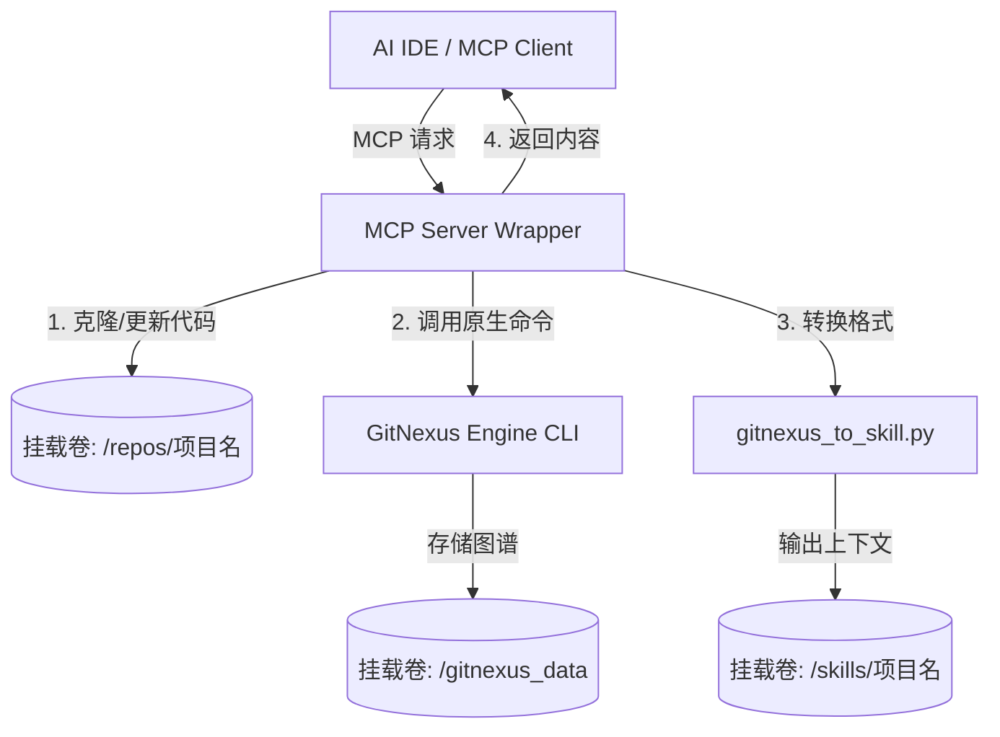

# GitNexus 极简中心化服务方案 (基于原生能力)

## 1. 背景与目标

目前 `gitnexus.sh` 主要是按需触发、针对单个项目的一次性脚本分析。实际上，底层的 GitNexus 本身支持长期运行以及多项目分析。为了实现中心化服务和 MCP 接入，我们**不再增加复杂的外部组件（如任务队列、关系型数据库等）**，而是通过极简的封装直接复用其原生能力。

目标包括：
1. **长期运行**：以守护进程/常驻容器方式提供服务。
2. **原生多库支持**：复用 GitNexus 本身跨项目分析的能力，通过不同的持久化目录隔离项目。
3. **极简 MCP 封装**：提供一个轻量级 MCP Wrapper，只负责监听请求、触发原有脚本并返回结果。
4. **数据持久化**：仅依赖简单的目录卷挂载，重启不丢失生成结果和内部图谱数据。

---

## 2. 极简架构设计

整体架构抛弃了复杂的消息队列和数据库，采用“**单一容器 + MCP Wrapper + 目录隔离**”的设计：



---

## 3. 持久化与多项目管理 (Docker Volumes)

完全依靠 Docker 卷映射和文件系统实现多项目支持与数据持久化，实现重启不丢失：

- **`/repos` (代码仓库卷)**
  以 `<owner>/<repo>` 的目录结构存放不同项目的代码。MCP 收到分析请求时，如果目录已存在，则执行 `git pull` 更新；如果不存在则执行 `git clone`，避免全量重复拉取。
  
- **`/gitnexus_data` (原生图谱缓存卷)**
  存放 GitNexus 原生引擎运行时生成的图形数据（如 Neo4j 或本地存储）。容器重启后可以接着上次的图谱数据继续使用。
  
- **`/skills` (最终产物卷)**
  存放各个项目的 `SKILL.md` 和 `.context-facts.json`。也是 MCP Server 读取返回结果的地方。

---

## 4. 极简 MCP 接口与执行流

由于去掉了复杂的异步 Job Queue，MCP Server 只暴露一个最核心的接口：

### `get_or_analyze(repo_url)`

**内部线性执行逻辑**：
1. **解析请求**：根据 `repo_url` 提取项目名称。
2. **同步代码**：在 `/repos` 下执行 Git 拉取或更新 (`git clone/pull`)。
3. **原生分析**：调用原有的分析脚本：
   `gitnexus analyze /repos/<项目名> --skills`
4. **生成上下文**：执行 Python 脚本转换产物：
   `python gitnexus_to_skill.py /repos/<项目名> --output /skills/<项目名>`
5. **返回内容**：直接读取并返回 `/skills/<项目名>/SKILL.md` 文件内容给大模型。

*(如果分析时间较长，由于 MCP 支持较长超时，可直接阻塞等待执行完成，或者用简单的本地进程状态返回进度。)*

---

## 5. 极简部署方案 (docker-compose)

无需外部依赖，只需运行单一服务，利用现有镜像加上一个 MCP Server 入口即可：

```yaml
version: '3.8'
services:
  gitnexus-central:
    build: 
      context: ./scripts/docker/gitnexus
    # 启动轻量级 MCP Server (如 Node/Python 编写)
    command: ["python", "mcp_server_wrapper.py"] 
    ports:
      - "3000:3000" # MCP Server 监听端口
    volumes:
      - ./data/repos:/repos               # 持久化代码
      - ./data/gitnexus:/root/.gitnexus   # 持久化原生图谱数据
      - ./data/skills:/skills             # 持久化分析产物
      - ~/.ssh:/root/.ssh:ro              # 提供拉取私有代码的凭证
    restart: always
```

## 6. 总结

该方案**零外部服务依赖**，保留了 GitNexus 工具最纯粹的原生工作流。通过将现有的分析流程包裹在一个简易的 MCP Server 中，并利用持久化目录来做本地多项目隔离，**以最低的开发成本**实现了代码库在远端的集中式分析与全局知识持久化，完美支撑各个客户端使用 `get_or_analyze` 按需取用项目上下文。

## 7. 生成上下文（SKILL 文件）在哪执行？

**生成上下文的完整过程是在这个长期运行的中心化容器内部执行的。**

具体流程如下：
1. **MCP 收到请求**：容器内的 MCP Server 收到要求分析 `repo_url` 的请求。
2. **代码获取 (容器内执行)**：容器内利用配置好的 Git 凭证，将目标代码库克隆或更新到容器内的持久化目录 `/repos/<项目名>`。
3. **原生分析 (容器内执行)**：容器内调用 GitNexus CLI 分析 `/repos/<项目名>` 下的代码，并在 `/gitnexus_data` 生成原生知识图谱和初步结果。
4. **格式转换 (容器内执行)**：容器内执行 `python gitnexus_to_skill.py`，将初步结果转换为统一格式的 `SKILL.md` 和 `.context-facts.json`。
5. **持久化保存 (容器内写入)**：这些最终的上下文文件被写入容器内的 `/skills/<项目名>` 目录中。因为 `/skills` 目录通过 Docker Volume 映射到宿主机，所以这些生成结果天然被**持久化保存**。
6. **返回结果**：MCP Server 直接读取刚生成的 `/skills/<项目名>/SKILL.md`，通过网络将内容返回给开发者的 IDE。

通过把所有这些操作——拉代码、分析、转换、保存——全集中在**中心化容器内部**，开发者的本地机器就**完全不需要**下载仓库的完整源码、配置分析环境、或执行重计算任务，做到了真正的即用即弃。

## 8. 项目上下文的“两阶段”完成机制（如何完成最终填充？）

GitNexus 中心化服务生成的是**带有 `{{LLM_*}}` 占位符的骨架 SKILL** 和事实数据（`facts.json`）。**最终的上下文填充依然在开发者的目标项目（本地）中完成。**

这里采用了**“云端重计算提取 + 本地轻量化推理”**的两阶段协作机制：

### 阶段一：中心端（重度静态分析，生成骨架）
- **执行者**：GitNexus 中心化容器
- **动作**：拉取代码 -> 构建调用图 -> 提取事实数据 -> 拼接生成 `SKILL.md` 骨架。
- **产物**：包含 `{{LLM_ARCHITECTURE}}`、`{{LLM_CORE_PRINCIPLES}}` 等占位符的初步文档，以及提取的结构化事实 `.context-facts.json`。

### 阶段二：本地目标项目端（LLM 动态推理与填充）
- **执行者**：开发者本地 IDE 中的 AI Agent（如 Windsurf, Cursor）
- **动作**：
  1. **拉取骨架**：本地 AI Agent 执行 `/0-制定项目上下文` 时，通过 MCP 的 `get_or_analyze` 接口，将中心端生成的骨架 `SKILL.md` 和 `facts.json` **下载到本地目标项目的 `__AGENT_SKILLS_DIR__/project-context/` 目录**。
  2. **推理填充**：本地 AI Agent 按照 `0-制定项目上下文.md` 的指令（阶段 2），读取本地的 `facts.json`，在本地环境进行大模型推理，将 `{{LLM_*}}` 占位符替换为真实的自然语言描述。
  3. **保存产物**：填充完成后的**最终完整版 `SKILL.md` 被保存在开发者的本地目标项目中**，并可随 Git 提交。

**总结**：中心服务器承担了“耗时、耗内存的代码图谱解析”脏活累活；而“结合语境进行大模型推理和最终文本填充”这一步，依然保留在开发者的目标项目本地完成。这样既保证了效率，又确保了生成的上下文能完美落地在目标项目中。


## 9. 开启 GitNexus 原生大模型能力全自动生成 Wiki

您说得完全正确，**GitNexus 本身的核心功能就是通过解析代码和图谱，结合大模型直接生成详细的项目 Wiki（包含架构说明、模块详情、业务流程等）**。

在中心化架构下，我们完全**不需要自己写额外的 Python 脚本去调大模型**，而是直接释放 GitNexus 原生的能力：

### 9.1 原生 Wiki 生成原理
GitNexus 内部自带了 Prompt 引擎和 LLM 调用链。当它在分析完 AST（语法树）和调用图（Call Graph）后，原本就会去请求 LLM 生成每个模块的摘要和整体架构的解释。

我们目前在 `SKILL.md` 里看到的那些 `{{LLM_*}}` 占位符，其实是为了**适配那些没有在分析阶段配置大模型**的场景，留给客户端 IDE 里的 Agent 后来补填的。

### 9.2 对接本地大模型 (Ollama)
既然您服务器上已经部署了 Ollama (`qwen2.5:3b`)，我们只需要在启动中心化容器时，将大模型的环境变量“喂”给 GitNexus 原生引擎即可（通常兼容 OpenAI 接口规范）：

在 `docker-compose.yml` 中添加环境变量即可：
```yaml
    environment:
      # 让 GitNexus 把 Ollama 伪装成 OpenAI API 来调用
      - OPENAI_API_KEY=ollama
      - OPENAI_BASE_URL=http://<宿主机IP>:11434/v1
      - LLM_MODEL=qwen2.5:3b
```

### 9.3 全自动工作流（真正的 One-Stop）

配置好本地模型后，中心化服务的完整工作流变成了：

1. **MCP 收到请求**：获取 `repo_url`。
2. **Git 拉取代码**：同步到 `/repos`。
3. **原生全自动分析**：GitNexus CLI 启动，它先做静态图谱分析，接着**直接在容器内调用您的 Ollama 接口**，将所有代码逻辑翻译成详细的 Markdown Wiki 内容。
4. **格式适配**：`gitnexus_to_skill.py` 运行时，由于 GitNexus 已经拿到了大模型生成的真实描述文本，它**不再生成占位符**，而是直接输出实打实的架构描述、核心流程、规则等。
5. **返回给开发者**：开发者在 IDE 里执行命令后，拿到的是一份**满血、内容极其丰富且已经排版好的 Wiki 知识库**。

**结论**：利用 GitNexus **原生的 Wiki 生成能力 + 您的本地 Ollama 模型**，中心化服务彻底包揽了所有计算和推理工作。开发者的本地机器实现了真正的“零负担”，只负责查阅和基于该 Wiki 写代码即可。
